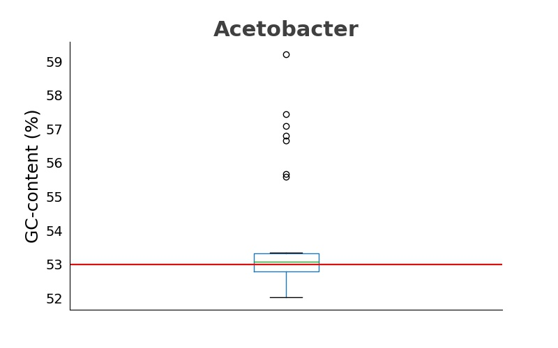

# **CONTACT**

>This code was developed as part of a project carried out during the course of Microbial Metagenomics (Molecular Biology master degree) at the University of Padova. The project was supervised by Prof. Stefano Campanaro and Dr. Arianna Basile.


CONTACT is a command line application written in Python language. It compares metagenome-assembled genomes (MAGs) characteristics, such as genome size and GC content, with a reference genomes set of isolated in NCBI database. MAGs are often assembled using single-copy core genes, which is a good way to estimate completness of genomes; however if MAGs are very fragmented, this approach could not ensure that the whole genome has been assembled, especially when marker genes are clustered. Therefore CONTACT can be useful to test if the assembly of genomes under investigation has high or low quality.

### **Installation**
1. clone the repository on your machine
   ```
   git clone https://github.com/artur-sannikov/contact.git
   ```
2. Install requirements 
   ```
   conda create -n <env> --file requirements.txt
   ```

### **How to run the script**
Run the following command in the terminal:

 ```
 python contact.py --genomes <path_to_directory>/<checkM_output.txt> --ncbi_genomes <path_to_directory>/<ncbi_genomes.csv> --taxonomy <path_to_directory>/<taxonomy.txt>
 ```

### **Input files**

- ##### Input file `--genomes`
  
  > --genomes <path_to_directory>/<checkM_output.txt>

  The input file for MAGs should be generated using *checkM* with default parameters. This software was tested using *checkM v1.0.12*, it may not work with other versions.

- ##### Input file `--ncbi_genomes`

  > --ncbi_genomes <path_to_directory>/<ncbi_genomes.csv>

  The input file was downloaded from [NCBI Microbial Genomes](https://www.ncbi.nlm.nih.gov/genome/browse#!/prokaryotes/) and it was used as reference.

- ##### Input file `--taxonomy`

  > --taxonomy <path_to_directory>/<taxonomy.txt>
  
  The input file for the taxonomy of MAGs should be generated using *GTDB-Tk v1.3.0* and then, it should be converted to NCBI classification using *[gtdb_to_ncbi_majority_vote.py](https://github.com/Ecogenomics/GTDBTk/blob/staging/scripts/gtdb_to_ncbi_majority_vote.py)*. *(Chaumeil PA, et al. 2019. GTDB-Tk: A toolkit to classify genomes with the Genome Taxonomy Database. Bioinformatics, btz848.)*

##### **Number of entries**
There also is an optional function that permit to add a threshold to the number of entries in NCBI database.
  ```
> -- n_entries <threshold_to_the_number_of_entries>
  ```
If this parameter is not added, the threshold assumes the default paramerter of 5.

For example:

> --n_entries 5

It means that the software will exclude all the genus that have less that 5 genomes in the NCBI database.

##### **Completeness**
Another optional parameter about completeness of genomes can be added: the user can choose to select only complete genomes from NCBI database or to include also contigs and scaffold level.
  ```
> --completeness <completness_level_of_the_genomes>
  ```
If the user wants to select only complete genomes, *complete* should be written; if the user wants to use every completeness level of the genomes, *all* has to be written.
By default, this software filters out all non-complete genomes.


### **Output files** 

- ##### Tabular file
The output file will be a tsv file containing the name of the organism at the genus taxonomical level, the completness of the genome, its contamination, the number of scaffolds, the difference in GC-content between the genome under investigation and the reference one, the difference in size between the genome under investigation and the reference genome, the GC-content standard deviation and the genome size standard deviation.

> genus Completeness  Contamination # scaffolds GC_diff genome_size_diff  GC_std  genome_size_std

For example:

> Acetobacter 97.81 2.9 232.0 -0.4854258064515875 -396565 0.2641939898860922  1.2488240665266874

- ##### Graphical output
Together with the tabular file, a folder called *boxplots* will be created. The folder includes other two folders, one called *GC-content*, the other called *genome-size*. They contain a series of boxplots that shows the distribution of GC-content values (or genome size values) for each genus. The boxplot is related to the reference genomes in NCBI database, in the same plot, the red line represents the mean value of GC-content (or genome size) of the input genome.

For example:



##### **Trick to interrogate the output**

To sort the output file according to the standard deviation of GC-content parameter, this command can be used:
  ```
> sed 1d report.tsv | sort -t$'\t' -k8 -nr | less -S
  ```
On this way, the genome under investigation that differs the most from its reference genome will appear as first of the list.
The number 8 after -k represents the GC-content standard deviation column, to change the parameter, the number of the column should be changed.