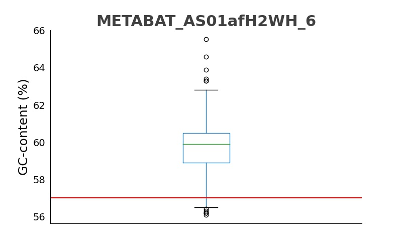

# **CONTACT**

>This code was developed as part of a project carried out during the course of Microbial Metagenomics (Molecular Biology master degree) at the University of Padova. The project was supervised by [Prof. Stefano Campanaro](https://github.com/stefcamp) and [Dr. Arianna Basile](https://github.com/arianccbasile).


CONTACT is a command-line application written in Python language. It compares metagenome-assembled genomes (MAGs) characteristics, such as genome size and GC-content, with a set of isolated reference genomes in the NCBI database. MAGs are often assembled using single-copy core genes, which is a good way to estimate the completeness of genomes; however, if MAGs are very fragmented or/and contaminated, this approach could not ensure that the whole genome has been assembled, especially when marker genes are clustered. Therefore, CONTACT can be useful to test if the assembly of genomes has high or low quality.

### **Installation**
1. Clone the repository on your machine
   ```
   git clone https://github.com/artur-sannikov/contact.git
   ```
2. Install requirements 
   ```
   conda create -n <env_name> --file requirements.txt
   ```

### **How to run the script**
To launch the script with default parameters, run the following command in the terminal:

 ```
 python contact.py --genomes <path_to_directory>/<checkM_output.txt> --ncbi_genomes <path_to_directory>/<ncbi_genomes.csv> --taxonomy <path_to_directory>/<taxonomy.txt>
 ```

### **Input files**

- ##### Input file `--genomes`
  
  > --genomes <path_to_directory>/<checkM_output.txt>

  The input file for MAGs should be generated using *checkM* with default parameters. This software was tested using *checkM v1.0.12*, it may not work with other versions.

- ##### Input file `--ncbi_genomes`

  > --ncbi_genomes <path_to_directory>/<ncbi_genomes.csv>

  The input file has to be downloaded from the [NCBI Microbial Genomes](https://www.ncbi.nlm.nih.gov/genome/browse#!/prokaryotes/) and it is used as reference.

- ##### Input file `--taxonomy`

```
--taxonomy <path_to_directory>/<taxonomy.txt>
```
  The input file for the taxonomy of MAGs should be generated using *GTDB-Tk v1.3.0* and then converted to NCBI classification using *[gtdb_to_ncbi_majority_vote.py](https://github.com/Ecogenomics/GTDBTk/blob/staging/scripts/gtdb_to_ncbi_majority_vote.py)*. *(Chaumeil PA, et al. 2019. GTDB-Tk: A toolkit to classify genomes with the Genome Taxonomy Database. Bioinformatics, btz848.)*

##### **Number of entries**
There also is an optional parameter that allows adding a threshold to the number of entries in the NCBI database.

```
--n_entries <threshold_to_the_number_of_entries>
```

If this parameter is not set, the threshold assumes the default parameter of 5.

For example:

> --n_entries 5

It means that the software will exclude genera with less than 5 representative genomes in the NCBI database.

##### **Completeness**
Another optional parameter for completeness of genomes can be set: the user can choose to select only complete genomes from the NCBI database or to include also contig and scaffold levels.

```
-completeness <level_of_completeness_of_genomes>
```

For example:

> --completeness all

If the user wants to select only complete genomes, *complete* should be written; if the user wants to use every completeness level of the genomes (complete, contig, and scaffold), *all* should be written. The default parameter is *complete*.


### **Output files** 

- ##### Tabular file
The output file is a *tsv* file containing some features of input genomes such as the genus they belong to, the Bin Id assigned by *checkM*, genome completeness, contamination, and the number of scaffolds. It also contains the difference in means of GC-content and genome size between input and reference genomes. The difference is computed as the difference between the measure of the input genome and the mean value of this measure for the genus the input genome belongs to in the NCBI database. The last two columns contain the numbers that indicate if a GC-content or a genome size is within a certain number of standard deviations. Both standard deviations were computed using the NCBI database and then the mean value of both measures (GC-content and genome size) of input genomes was divided by the corresponding standard deviation.

> genus Bin Id  Completeness  Contamination # scaffolds GC_diff genome_size_diff  GC_std  genome_size_std

For example:

> Acetobacter METABAT_AS27yjCOA_120 97.81 2.9 232 -0.485 -396565 0.264  1.249

where the columns are:
1. **Genus**: Acetobacter
2. **Bin Id**: METABAT_AS27yjCOA_120
3. **Completeness**: 97.81
4. **Contamination**: 2.9
5. **# scaffolds**: 232
6. **GC-content difference (%)**: -0.485
7. **Genome size difference**: -396565
8. **# of standard deviations of GC-content**: 0.264
9. **# of standard deviations of genome size**: 1.249

- ##### Graphical output
Together with the tabular file, a folder called *boxplots_complete* or *boxplots_all* will be created (depending on the input argument of the *completeness* parameter). The folder includes other two folders, one called *GC-content*, the other called *genome-size*. They contain boxplots with the distribution of GC-content values (or genome size values) for each genus from the NCBI database. In the same plot, the red line indicates the mean value of GC-content or genome size of the input genome with respect to the distribution of GC-content of genome size of the genus the input genome belongs to.

For example:



##### **Trick to interrogate the output**

To sort the output file according to the standard deviation of the GC-content parameter, this command can be used:
  ```
> sed 1d report.tsv | sort -t$'\t' -k8 -nr | less -S
  ```
In this way, the genomes are listed in decreasing order by the number that shows if the genomes lie within a certain number of standard deviations.
The number 8 after -k indicates the GC_std column. The user can freely select the column to sort by changing this number.
=======
# **CONTACT**

>This code was developed as part of a project carried out during the course of Microbial Metagenomics (Molecular Biology master degree) at the University of Padova. The project was supervised by [Prof. Stefano Campanaro](https://github.com/stefcamp) and [Dr. Arianna Basile](https://github.com/arianccbasile).


CONTACT is a command line application written in Python language. It compares metagenome-assembled genomes (MAGs) characteristics, such as genome size and GC-content, with a set of isolated reference genomes in the NCBI database. MAGs are often assembled using single-copy core genes, which is a good way to estimate the completeness of genomes; however, if MAGs are very fragmented or/and contaminated, this approach could not ensure that the whole genome has been assembled, especially when marker genes are clustered. Therefore, CONTACT can be useful to test if the assembly of genomes under investigation has high or low quality.

### **Installation**
1. Clone the repository on your machine
   ```
   git clone https://github.com/artur-sannikov/contact.git
   ```
2. Install requirements 
   ```
   conda create -n <env> --file requirements.txt
   ```

### **How to run the script**
To launch the script with default parameters, run the following command in the terminal:

 ```
 python contact.py --genomes <path_to_directory>/<checkM_output.txt> --ncbi_genomes <path_to_directory>/<ncbi_genomes.csv> --taxonomy <path_to_directory>/<taxonomy.txt>
 ```

### **Input files**

- ##### Input file `--genomes`
  
  > --genomes <path_to_directory>/<checkM_output.txt>

  The input file for MAGs should be generated using *checkM* with default parameters. This software was tested using *checkM v1.0.12*, it may not work with other versions.

- ##### Input file `--ncbi_genomes`

  > --ncbi_genomes <path_to_directory>/<ncbi_genomes.csv>

  The input file has to be downloaded from the [NCBI Microbial Genomes](https://www.ncbi.nlm.nih.gov/genome/browse#!/prokaryotes/) and it is used as reference.

- ##### Input file `--taxonomy`

  > --taxonomy <path_to_directory>/<taxonomy.txt>
  
  The input file for the taxonomy of MAGs should be generated using *GTDB-Tk v1.3.0* and then converted to NCBI classification using *[gtdb_to_ncbi_majority_vote.py](https://github.com/Ecogenomics/GTDBTk/blob/staging/scripts/gtdb_to_ncbi_majority_vote.py)*. *(Chaumeil PA, et al. 2019. GTDB-Tk: A toolkit to classify genomes with the Genome Taxonomy Database. Bioinformatics, btz848.)*

##### **Number of entries**
There also is an optional parameter that allows to add a threshold to the number of entries in the NCBI database.
  ```
> -- n_entries <threshold_to_the_number_of_entries>
  ```
If this parameter is not set, the threshold assumes the default parameter of 5.

For example:

> --n_entries 5

It means that the software will exclude all the genusera with less than 5 representative genomes in the NCBI database.

##### **Completeness**
Another optional parameter for completeness of genomes can be set: the user can choose to select only complete genomes from the NCBI database or to include also contig and scaffold levels.
  ```
> --completeness <completness_level_of_the_genomes>
  ```
If the user wants to select only complete genomes, *complete* should be written; if the user wants to use every completeness level of the genomes, *all* should be written. The default parameter is *complete*.


### **Output files** 

- ##### Tabular file
The output file is a *tsv* file containing some features of input genomes such as genus they belong to, the Bin Id assigned by *checkM*, genome completeness, contamination, and the number of scaffolds. It also contains the difference in means of GC-content and genome size between input and reference genomes at genus level. The last two columns contain the numbers that indicate if a GC-content or a genome size is within a certain number of standard deviations. Both stardard deviations were computed using the NCBI database and then the mean value of both statistics of input genomes was divided by the corresponding standard deviation.

> genus Bin Id  Completeness  Contamination # scaffolds GC_diff genome_size_diff  GC_std  genome_size_std

For example:

> Acetobacter METABAT_AS27yjCOA_120 97.81 2.9 232.0 -0.4854258064515875 -396565 0.2641939898860922  1.2488240665266874

- ##### Graphical output
Together with the tabular file, a folder called *boxplots_complete* or *boxplots_all* will be created (depending on the input argument of the *completeness* parameter). The folder includes other two folders, one called *GC-content*, the other called *genome-size*. They contain boxplots with the distribution of GC-content values (or genome size values) for each genus. The boxplot is related to the reference genomes in NCBI database, in the same plot, the red line represents the mean value of GC-content (or genome size) of the input genome.

For example:


##### **Trick to interrogate the output**

To sort the output file according to the standard deviation of GC-content parameter, this command can be used:
  ```
> sed 1d report.tsv | sort -t$'\t' -k8 -nr | less -S
  ```
In this way, the genomes are listed in decreasing order by the number that shows if the genomes lie within a certain number of standard deviations.
The number 8 after -k represents the GC_std column. To change the parameter, the number of the column should be changed.
>>>>>>> 3143ae5891e38ef93c597cc7bd91cd0fef302c36
